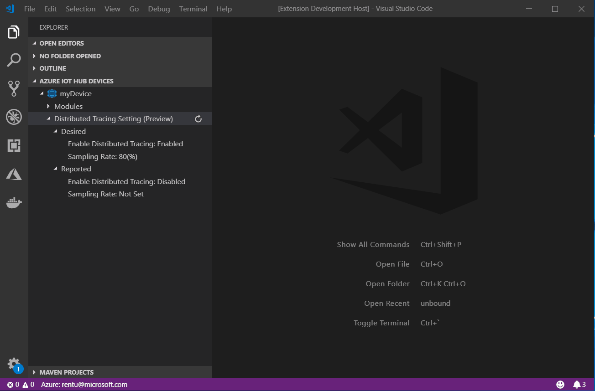
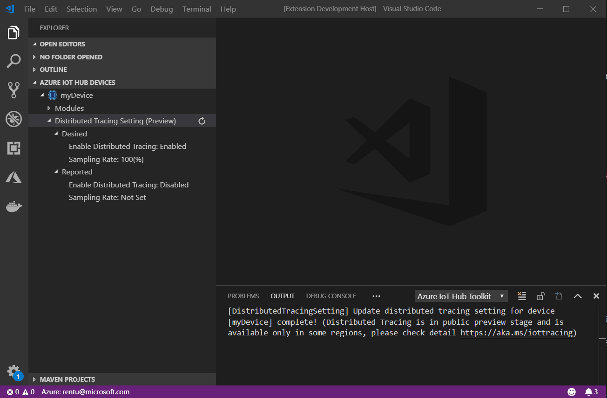
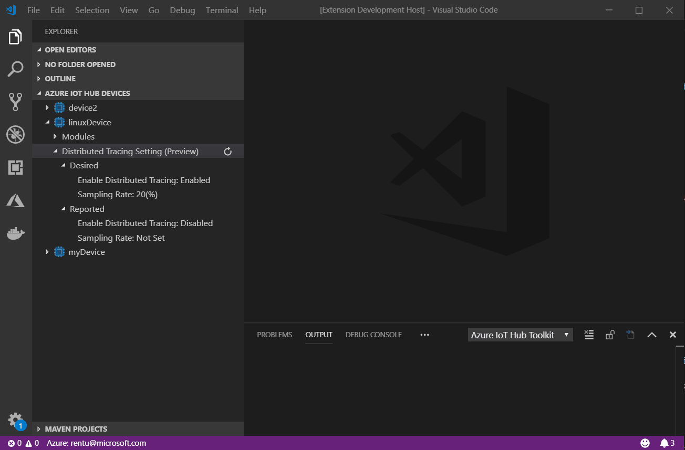

## Update Distributed Tracing for Single Device
Command: **Azure IoT Hub: Update Distributed Tracing Setting (Preview)**

Right click the title of **"Distributed Tracing Setting (Preview)"** and select **"Update Distributed Tracing Setting (Preview)"** in the device tree, then select whether enable or disable the distributed tracing, if you select enable distributed tracing, and you will be asked to provide a sampling rate between [0, 100] (%)

You can also enable / disable the distributed or set sampling rate separately through **"Edit..."** context menu in **"Enable Distributed Tracing"** and **"Sampling Rate"** Label:

## Update Distributed Tracing for Multiple Devices

To update distributed tracing for multiple devices, you can use command **"Azure IoT Hub: Update Distributed Tracing Setting (Preview)"** through command palette, and then select multiple devices, after selecting whether enable / disable the distributed tracing and enter sampling rate, all of the distributed tracing settings for selected devices would be updated.

